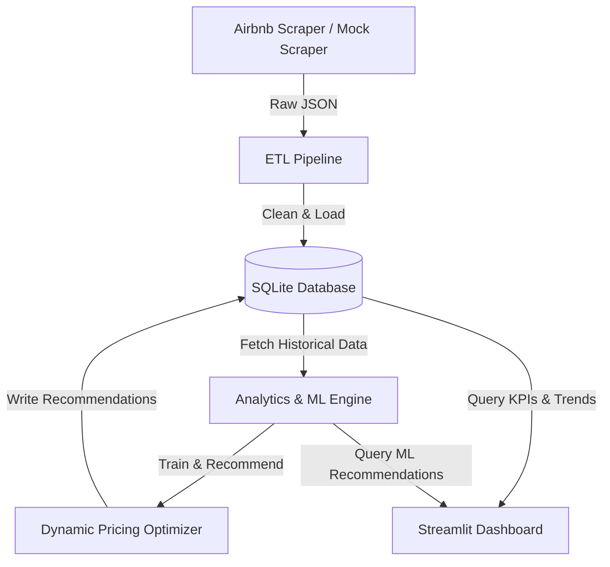

# Airbnb Market Intelligence & Dynamic Pricing Platform

A professional-grade **Revenue Management & Dynamic Pricing Platform** designed for short-term rental hosts and property managers. This application functions as an end-to-end data product demonstrating skills in **Data Engineering, Web Scraping, ETL Pipelines, Machine Learning (ML), and Interactive Visualization**.

---

## Key Features

1. **Dual-Mode Data Ingestor**:
   - **Real Scraper**: Extracts public listing and search data from Airbnb using requests/headers and BeautifulSoup JSON extraction.
   - **Dynamic Simulator**: Generated using a state-free deterministic mathematical model that provides listing attributes, reviews, and bookings over time (enabling instant, zero-setup portfolio demonstrations).

2. **Incremental ETL & Occupancy Delta Tracking**:
   - Processes raw data daily and loads structured tables in a local **SQLite** relational database.
   - Implements **Calendar Delta Tracking**: compares daily calendar snapshots to detect real-time booking events (when a check-in date goes from *available* to *booked* between runs).
   - Computes forward-looking 30-day occupancy rates.

3. **Hybrid Pricing Model (ML & Rules)**:
   - **k-Nearest Neighbors (k-NN)**: Matches target listings with their top 5 closest geographical and capacity competitors using a weighted similarity score (Haversine distance + room configurations).
   - **Random Forest Regressor**: Fits check-in date seasonality, listing features, and market indicators to predict rates.
   - **Revenue Management Overlays**: Applies weekend premiums, high/low season factors, last-minute discounts based on lead time, and anchors recommendations to competitor pricing boundaries.

4. **Sleek Glassmorphic Dashboard**:
   - Built with **Streamlit** and **Plotly**, styled with a curated dark theme.
   - Features interactive Mapbox distribution scatter plots, competitor radar plots, and 30-day recommended price trends.
   - Includes a SQL Query Sandbox and execution monitor to audit pipeline integrity.

---

## System Architecture



---

## Database Relational Schema

The database uses SQLite with foreign key enforcement and indexes:
- `listings`: Dimensions table for listing metadata.
- `listings_daily`: Ingestion snapshot tracking prices, ratings, reviews, and computed occupancy.
- `calendar_snapshots`: Future availability matrix (30 days out) used to detect bookings.
- `booking_events`: Transactions captured when calendar dates transition from available to booked.
- `price_recommendations`: Daily output of the dynamic pricing engine.

---

## Quickstart Guide

### 1. Prerequisites
Ensure you have Python 3.9+ installed.

### 2. Installation
Clone the repository and install the dependencies:
```bash
# Clone the repository (or navigate to folder)
cd d:/Projects/airbnb-market-intelligence

# Install requirements
pip install -r requirements.txt
```

### 3. Run the Dashboard
Start the Streamlit application:
```bash
streamlit run src/dashboard/app.py
```

### 4. Hydrate Simulation Data
On first boot, the dashboard will notice the database is empty. 
1. Open the sidebar.
2. Click **🚀 Hydrate 14-Day Simulation**.
3. The platform will run 14 days of backdated scraping, ingest files through the ETL pipeline, train the Random Forest pricing model, and write price predictions.
4. Explore the **Market Explorer** and **Property Optimizer** tabs!
