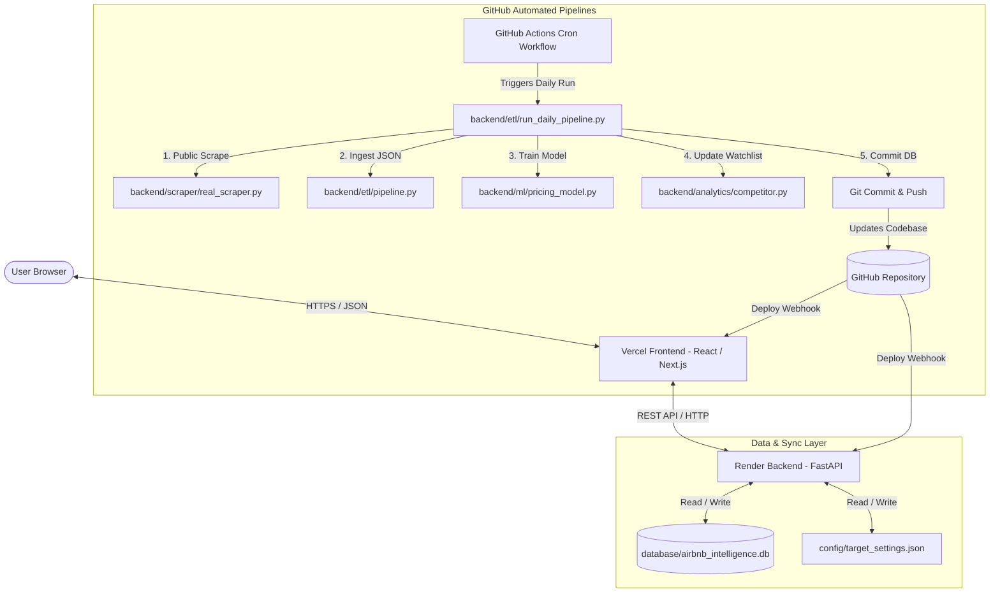

# AirMarket AI - Revenue Management & Dynamic Pricing Platform

AirMarket AI is a production-grade, enterprise **Revenue Management & Dynamic Pricing SaaS Platform** built for short-term rental hosts and property managers. It implements end-to-end data ingestion, automated ETL, k-NN competitor indexing, machine learning regression, and a stunning Next.js user interface.

---

## 🚀 Key Features

1. **Decoupled Modern SaaS Architecture**:
   - **Frontend**: A Single Page Application (SPA) built using Next.js 16 (React), styled with custom glassmorphic CSS, micro-animations, Leaflet map preview, and a custom pricing calendar grid.
   - **Backend**: High-performance FastAPI (Python) server processing database migrations, k-NN calculations, and manual pricing overrides.

2. **Real-time Web Scraper & ETL Pipeline**:
   - Rotates User-Agents and mimics standard web browser headers to scrape public Airbnb pages.
   - ETL pipeline processes scraped raw files daily, computes forward-looking 30-day occupancy rates, and detects real-time booking transactions via calendar delta changes.

3. **Hybrid Pricing Engine (ML & Rules)**:
   - **k-Nearest Neighbors (k-NN)**: Matches target listings with their top 20 closest competitor properties within a strict **1.5km limit radius** using a weighted similarity metric (Haversine distance + room configurations + amenities matching).
   - **Rules Resolver**: Decides final recommendations by prioritizing: 1. Manual Overrides, 2. Web Scrapes, 3. Default YAML rules.

4. **Git-as-a-Database (GitDB)**:
   - Utilizes GitHub as an automated state storage ledger. Daily cron runs in GitHub Actions save scraping outputs and database changes directly to the repository, triggering serverless redeployment automatically.

---

## 🏛️ High-Level System Architecture

---

## 📂 Repository Directory Tree

For details on the workspace layout, check the [Project Index Directory Tree](file:///d:/Projects/airbnb-market-intelligence/docs/PROJECT_INDEX.md#%F0%9F%93%85-repository-directory-tree).

---

## 💻 Local Development Setup

To start developing the backend and frontend locally, follow the steps inside our [Local Development Guide](file:///d:/Projects/airbnb-market-intelligence/docs/deployment.md#%F0%9F%92%BB-local-development-setup).

---

## 📖 Technical Documentation

Dedicated specifications are available in the `/docs` directory:

- 🏛️ [System Architecture Specification](file:///d:/Projects/airbnb-market-intelligence/docs/architecture.md)
- 🐍 [Python Backend REST API Server](file:///d:/Projects/airbnb-market-intelligence/docs/backend.md)
- 🌐 [Next.js React Frontend Application](file:///d:/Projects/airbnb-market-intelligence/docs/frontend.md)
- 🗄️ [SQLite Database Dimensions & Schema](file:///d:/Projects/airbnb-market-intelligence/docs/database.md)
- 🕸️ [Public Scraper & Rate Limit Defenses](file:///d:/Projects/airbnb-market-intelligence/docs/scraper.md)
- 📈 [Pricing Model Rule-Resolver](file:///d:/Projects/airbnb-market-intelligence/docs/pricing-engine.md)
- 🔮 [Revenue Simulation & RevPAR Forecasts](file:///d:/Projects/airbnb-market-intelligence/docs/recommendation-engine.md)
- 👥 [Haversine & k-NN Competitor Matcher](file:///d:/Projects/airbnb-market-intelligence/docs/competitor-engine.md)
- 📶 [REST API Endpoints Specifications](file:///d:/Projects/airbnb-market-intelligence/docs/api.md)
- 🤖 [GitHub Actions Automated Workflows](file:///d:/Projects/airbnb-market-intelligence/docs/github-actions.md)
- 🔮 [SaaS Project Milestones Roadmap](file:///d:/Projects/airbnb-market-intelligence/docs/roadmap.md)
- 📝 [Keep a Changelog Ledger](file:///d:/Projects/airbnb-market-intelligence/docs/changelog.md)

---

## 🤝 Contributing

Contributions are welcome! Please read the [Contributing Guidelines](file:///d:/Projects/airbnb-market-intelligence/CONTRIBUTING.md) to align with our Conventional Commits formatting and testing procedures.

---

## 📄 License

Distributed under the MIT License. See `LICENSE` for more information.
