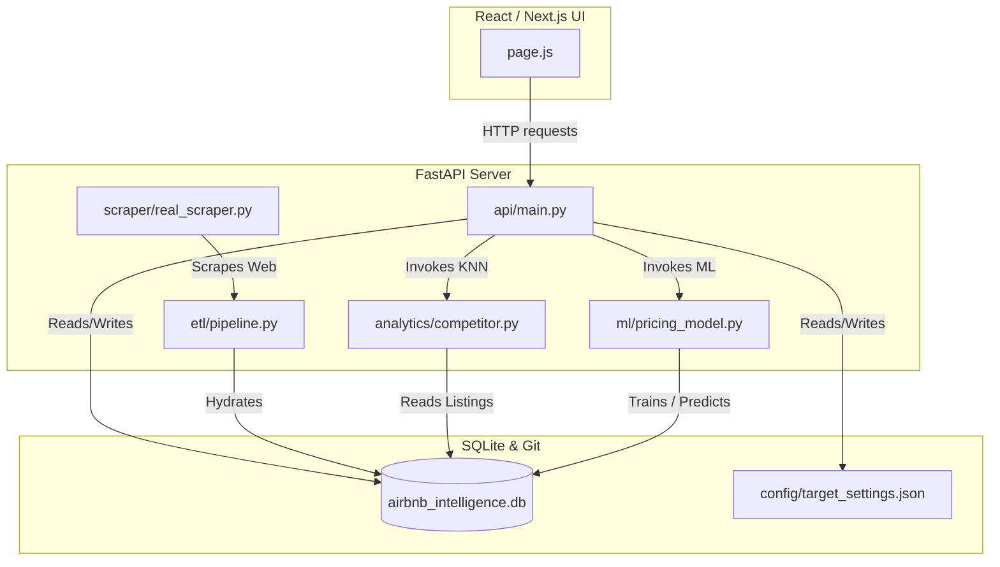

# Project Index & Developer Hub

Welcome to the AirMarket AI developer hub. This document serves as the central entry point and navigation system for the entire codebase.

---

## 📂 Repository Directory Tree

```
airbnb-market-intelligence/
├── .github/                  # CI/CD and automated pipelines
│   └── workflows/
│       └── daily_scrape.yml  # Daily data ingestion cron job
├── backend/                  # Python backend application
│   ├── analytics/            # Market intelligence calculations (k-NN)
│   │   └── competitor.py     # Competitor search and scoring
│   ├── api/                  # FastAPI web server
│   │   └── main.py           # Web endpoints & request routing
│   ├── dashboard/            # Legacy Streamlit UI components
│   │   ├── app.py
│   │   ├── charts.py
│   │   └── styles.py
│   ├── etl/                  # Data Extraction, Transformation, and Load
│   │   ├── pipeline.py       # JSON to SQLite parser
│   │   └── run_daily_pipeline.py # Daily pipeline coordinator
│   ├── ml/                   # Machine learning models & pricing
│   │   └── pricing_model.py  # Pricing recommendation engine
│   ├── scraper/              # Scraping engine modules
│   │   ├── base.py           # Scraper base interface
│   │   ├── real_scraper.py   # HTTP-based regex public scraper
│   │   └── scheduler.py      # Scraper queue controller
│   └── utils/                # Helper libraries
│       ├── db.py             # Database connector and migrations
│       ├── git_db.py         # Git-as-a-Database sync helper
│       └── holidays.py       # Argentina holidays lookup
├── config/                   # Global configuration parameters
│   ├── settings.yaml         # Scraper, ML, & system weights
│   └── target_settings.json  # Current target property details & overrides
├── database/                 # SQLite database storage
│   └── airbnb_intelligence.db # Persistent database
├── docs/                     # Technical documentation
│   ├── api.md                # API endpoints catalog
│   ├── architecture.md       # High-level architecture & diagrams
│   ├── backend.md            # Backend modules details
│   ├── changelog.md          # Release changes ledger
│   ├── competitor-engine.md  # k-NN matcher technical description
│   ├── database.md           # Database tables and constraints
│   ├── deployment.md         # Local and cloud deployment guide
│   ├── frontend.md           # Next.js React UI module details
│   ├── github-actions.md     # GitHub Actions workflow guide
│   ├── pricing-engine.md     # Dynamic pricing strategy rules
│   ├── recommendation-engine.md # Projections and simulation formulas
│   ├── roadmap.md            # Features completed and planned
│   └── scraper.md            # Anti-blocking public scraper logic
├── frontend/                 # React Next.js user interface
│   ├── public/               # Static assets & images
│   └── src/
│       └── app/
│           ├── page.js       # Main single-page application router
│           └── globals.css   # Global styles & design tokens
├── Dockerfile                # Production backend containerization
├── README.md                 # Project README
├── CONTRIBUTING.md           # Contribution guidelines
├── LICENSE                   # Software license
├── requirements.txt          # Python dependencies
└── .env                      # Local environment configuration
```

---

## 🏛️ Module Dependency Map

The following Mermaid diagram shows how the different modules of the system interact:



---

## 🔄 Core Data Ingestion & Pricing Flow

1. **Scraping Trigger**: The daily cron workflow in GitHub Actions (or an on-demand trigger) starts `run_daily_pipeline.py`.
2. **Web Scraping**: The `RealAirbnbScraper` queries the public Web pages of Airbnb, downloading listing details and calendars into raw JSON files in `database/raw/`.
3. **ETL Processing**: The `ETLPipeline` parses the JSON files, extracts listing metrics and daily price snapshots, computes forward 30-day occupancy, and updates the `listings` and `listings_daily` SQLite tables.
4. **Competitor Watchlist Update**: The `CompetitorAnalyzer` finds the closest competitors for the target listing within a **1.5km** radius and saves the links in `competitor_watchlist`.
5. **ML Training & Optimization**: The `DynamicPricingModel` trains on the updated database metrics, resolves the rules (incorporating manual overrides from `target_settings.json`), generates a 30-day price recommendation path, and saves it into `price_recommendations`.
6. **Git Synchronization**: The updated SQLite database and configuration files are pushed back to the Git repository by the workflow to keep the server state in sync.

---

## 📖 Technical Documentation Index

Click the links below to view the dedicated technical specification for each domain:

| Document | Description |
| :--- | :--- |
| 🏛️ [System Architecture](file:///d:/Projects/airbnb-market-intelligence/docs/architecture.md) | High-level system overview, design patterns, and deployment topologies. |
| 🌐 [Next.js Frontend](file:///d:/Projects/airbnb-market-intelligence/docs/frontend.md) | Single-page UI, custom state management, auto-save hook, and maps integration. |
| 🐍 [Python Backend](file:///d:/Projects/airbnb-market-intelligence/docs/backend.md) | FastAPI route controllers, modules structure, and design patterns. |
| 🗄️ [Database Schema](file:///d:/Projects/airbnb-market-intelligence/docs/database.md) | Tables, data types, indexes, schema migrations, and ER diagrams. |
| 📶 [REST API Reference](file:///d:/Projects/airbnb-market-intelligence/docs/api.md) | Catalog of endpoints, parameters, JSON payload structures, and example codes. |
| 🕷️ [Scraper Pipeline](file:///d:/Projects/airbnb-market-intelligence/docs/scraper.md) | HTTP requests, beautifulsoup parsing, anti-blocking regexes, and scheduler. |
| 👥 [Competitor Engine](file:///d:/Projects/airbnb-market-intelligence/docs/competitor-engine.md) | Haversine distance, k-NN similarity weights, and 1.5km limit constraints. |
| 📈 [Pricing Engine](file:///d:/Projects/airbnb-market-intelligence/docs/pricing-engine.md) | Priority resolution (Overrides vs Default Rules) and ML training steps. |
| 🔮 [Recommendation Engine](file:///d:/Projects/airbnb-market-intelligence/docs/recommendation-engine.md) | Revenue simulation equations, RevPAR projections, and scenario weights. |
| 🚀 [Deployment Guide](file:///d:/Projects/airbnb-market-intelligence/docs/deployment.md) | Step-by-step setup for Vercel, Render, local development, and environment variables. |
| 🤖 [GitHub Workflows](file:///d:/Projects/airbnb-market-intelligence/docs/github-actions.md) | Cron scheduling, file commits automation, and pipeline diagnostics. |
| 🗺️ [Project Roadmap](file:///d:/Projects/airbnb-market-intelligence/docs/roadmap.md) | Status of completed, in-progress, and planned engineering features. |
| 📝 [Changelog Ledger](file:///d:/Projects/airbnb-market-intelligence/docs/changelog.md) | Complete version release notes following Keep a Changelog. |
