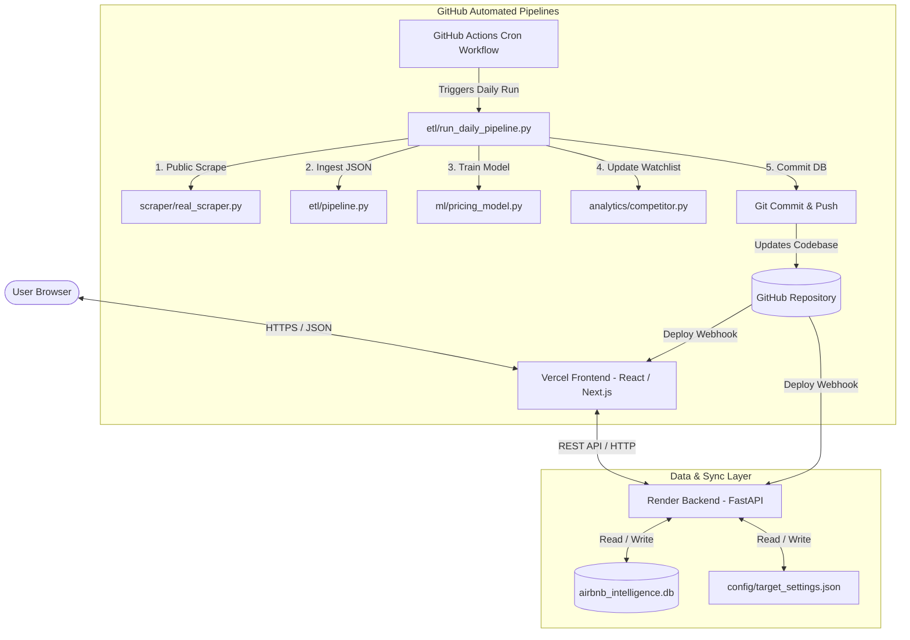
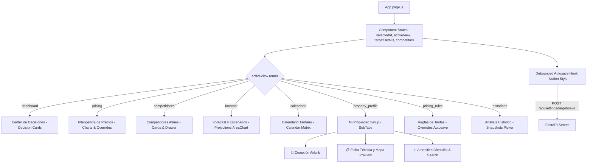
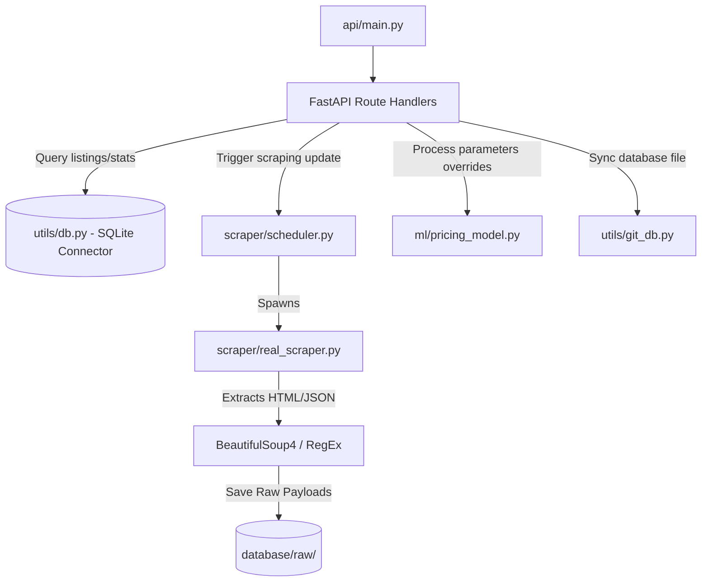
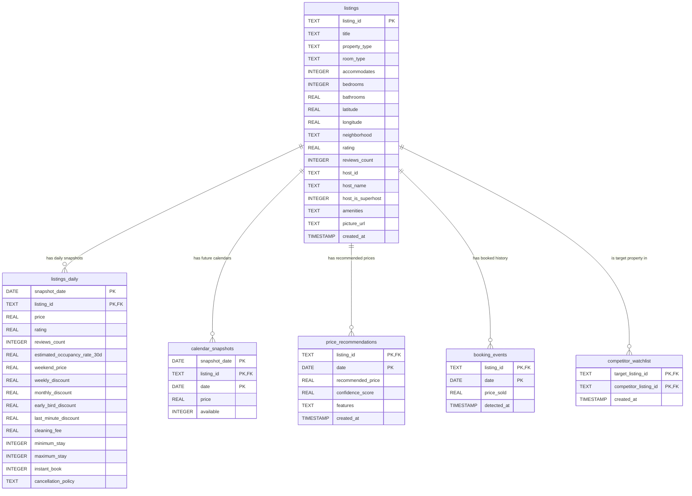
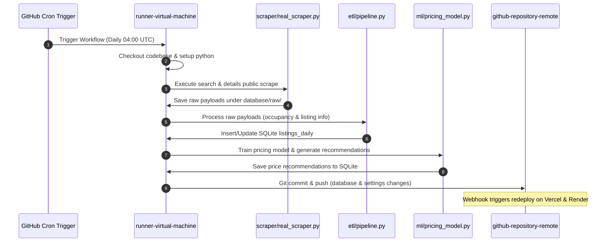
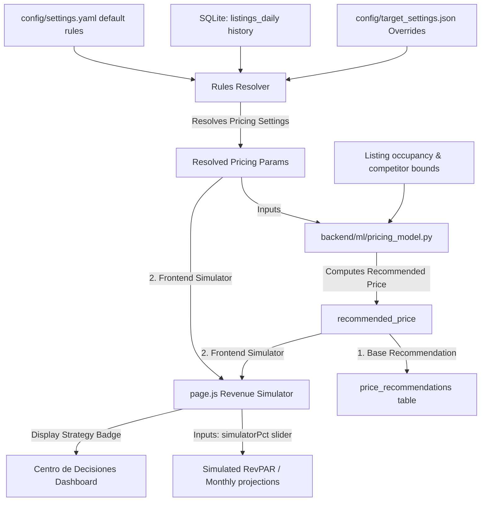

# System Architecture Specification

This document details the high-level system architecture, design patterns, and deployment topologies of the AirMarket AI application.

---

## 🏛️ High-Level System Architecture

AirMarket AI is built using a decoupled **Micro-SaaS architecture** composed of:
1. **Frontend UI**: A Single Page Application (SPA) built using Next.js (React), communicating with the backend API asynchronously.
2. **Backend API**: A FastAPI (Python) server providing endpoints for market analysis, pricing rules, pipeline execution status, and listing details.
3. **Scraper & ETL Pipeline**: A modular Python orchestration pipeline that scrapes public web pages of Airbnb, parses the data, runs the dynamic pricing model, and updates the database.
4. **Git-as-a-Database (GitDB)**: The system utilizes GitHub as a database synchronization ledger. Daily cron runs on GitHub Actions update the database and push commits directly to the repository, which triggers deployments on Render and Vercel automatically.

---

## 🌐 Next.js Frontend Architecture

The frontend is a single-page Next.js application built with vanilla CSS. It handles modular state routing internally:

---

## 🐍 Python Backend Architecture

The backend is modular and follows standard Python package conventions:

---

## 💾 Database ER Diagram

The database structure is normalized into dimension and fact tables, designed for historical tracking and fast query retrieval:

---

## 🤖 GitHub Actions Workflow Flow

The automated daily ingestion pipeline is driven by GitHub Actions:

---

## 📈 Recommendation & Simulation Engine Data Flow

Calculates user pricing recommendations, RevPAR projections, and simulator scenarios:

