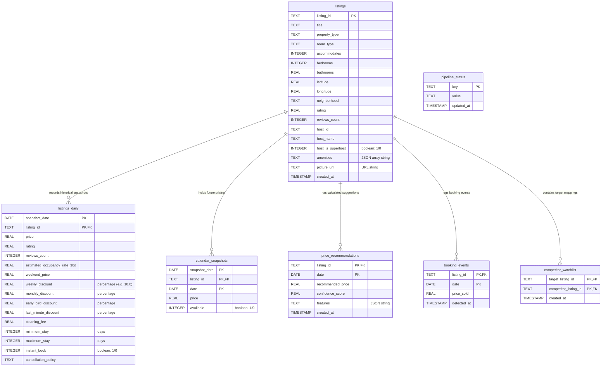

# Database Schema Specification

This document provides technical documentation for the SQLite database schema (`database/airbnb_intelligence.db`), details tables, attributes, indices, relationships, and data migrations.

---

## 🏛️ Schema Architecture (Entity Relationship Diagram)

---

## 🗄️ Table Specifications

### 1. `listings` (Dimension Table)
- **Description**: Stores primary, static parameters representing scraped listings.
- **Attributes**:
  - `listing_id` (TEXT, Primary Key): Unique ID of the Airbnb listing.
  - `title` (TEXT): Title of the Airbnb advertisement.
  - `property_type` (TEXT): Type of property (e.g. "Apartment").
  - `room_type` (TEXT): Type of room (e.g. "Entire home/apt").
  - `accommodates` (INTEGER): Maximum guest capacity.
  - `bedrooms` (INTEGER): Quantity of bedrooms.
  - `bathrooms` (REAL): Quantity of bathrooms.
  - `latitude` (REAL): Latitudinal coordinate.
  - `longitude` (REAL): Longitudinal coordinate.
  - `neighborhood` (TEXT): Neighborhood (e.g. "Palermo Hollywood").
  - `rating` (REAL): Review rating (0.0 to 5.0).
  - `reviews_count` (INTEGER): Quantity of review counts.
  - `host_id` / `host_name` (TEXT)
  - `host_is_superhost` (INTEGER): Boolean flag (1 = Yes, 0 = No).
  - `amenities` (TEXT): JSON array string of normalized amenities (e.g. `["Pool", "Gym"]`).
  - `picture_url` (TEXT): Cover picture url.
  - `created_at` (TIMESTAMP)

### 2. `listings_daily` (Fact Snapshot Table)
- **Description**: Stores daily snapshot parameters representing historical prices and occupancy rates.
- **Attributes**:
  - `snapshot_date` (DATE, Composite PK): Date of the scraping snapshot.
  - `listing_id` (TEXT, Composite PK, FK): Foreign Key linking to `listings.listing_id` with Cascade Delete.
  - `price` (REAL): Current price.
  - `rating` / `reviews_count`
  - `estimated_occupancy_rate_30d` (REAL): Calculated forward occupancy percentage.
  - `weekend_price` (REAL)
  - `weekly_discount` / `monthly_discount` / `early_bird_discount` / `last_minute_discount` (REAL)
  - `cleaning_fee` (REAL)
  - `minimum_stay` / `maximum_stay` (INTEGER)
  - `instant_book` (INTEGER)
  - `cancellation_policy` (TEXT)

---

## ⚡ Index Specifications

To optimize lookup speeds on large historical tables, the following indexes are declared in the schema:

1. `idx_listings_neighborhood` (ON `listings(neighborhood)`): Accelerates k-NN filtering queries by restricting search domains to local clusters.
2. `idx_daily_listing` (ON `listings_daily(listing_id)`): Speeds up historical calculations and time-series extraction for specific properties.
3. `idx_calendar_listing_date` (ON `calendar_snapshots(listing_id, date)`): Speeds up future calendar lookups and booking detection queries.
4. `idx_recommendations_listing` (ON `price_recommendations(listing_id)`): Accelerates dashboard chart rendering requests.
