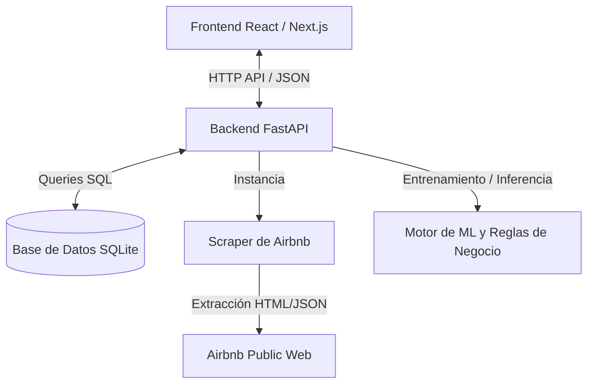

# Funcionamiento Interno de AirMarket AI

Este documento detalla la arquitectura técnica, las fórmulas matemáticas y los flujos de datos que componen la plataforma de Inteligencia de Mercado para Airbnb.

---

## 🏗️ Arquitectura General del Sistema

La plataforma utiliza una arquitectura desacoplada con un frontend moderno, una API REST robusta en Python y una base de datos relacional ligera.



### Componentes Clave:
*   **Frontend (Vercel):** Construido en Next.js. Maneja la visualización interactiva y calcula métricas dinámicas de rendimiento de mercado. Archivo principal: `frontend/src/app/page.js`.
*   **Backend (Render):** API REST implementada con FastAPI. Centraliza la orquestación del pipeline, cálculos de similitud y persistencia. Archivo principal: `src/api/main.py`.
*   **Scraper Inteligente:** Módulo que consulta y parsea búsquedas reales de Airbnb. Archivo principal: `src/scraper/real_scraper.py`.
*   **Motor de Similitud (k-NN) y ML:** Selecciona competidores comparables y predice tarifas optimizadas. Archivos: `src/analytics/competitor.py` y `src/ml/pricing_model.py`.

---

## 1. Pipeline de Ingesta y Búsqueda del Scraper

Cuando se ejecuta una actualización de mercado, el sistema realiza los siguientes pasos:

1.  **Alineación de Capacidad:** Lee la propiedad objetivo. Para evitar ruido en las búsquedas públicas, ajusta el número de huéspedes del buscador en base a los dormitorios reales de tu propiedad:
    $$\text{Dormitorios} = 1 \implies \text{Huéspedes de búsqueda} = 2$$
    $$\text{Dormitorios} = 2 \implies \text{Huéspedes de búsqueda} = 4$$
    $$\text{Dormitorios} \ge 3 \implies \text{Huéspedes de búsqueda} = 6$$
2.  **Consulta Externa:** Ejecuta peticiones HTTP camufladas (rotando User-Agents) a Airbnb con la estructura:
    `https://www.airbnb.com/s/{neighborhood}-Buenos-Aires/homes?adults={search_adults}`
3.  **Extracción de Amenities (Heurística):** Dado que Airbnb protege las páginas individuales tras Captchas, el scraper analiza los títulos y textos descriptivos del resultado de búsqueda para detectar equipamientos clave:
    *   *Pileta/Pool:* Detectado si contiene "pool", "pileta" o "piscina".
    *   *Cochera/Parking:* Detectado si contiene "parking", "cochera" o "estacionamiento".
    *   *Lavarropas/Laundry:* Detectado si contiene "laundry", "washer" o "lavarropas".
    *   *Jacuzzi:* Detectado si contiene "jacuzzi" o "hot tub".
4.  **Guardado en DB:** Almacena los registros en la tabla `listings` y los precios diarios del mercado en `listings_daily`.

---

## 2. Algoritmo de Similitud y Selección de Competidores (k-NN)

No todos los alojamientos del barrio compiten contigo. El sistema filtra y clasifica los candidatos usando dos capas de filtros:

### A. Capa de Filtros Estrictos (Hard Constraints)
Para evitar comparar manzanas con naranjas, el candidato debe cumplir obligatoriamente:
1.  **Dormitorios:** Coincidencia exacta con tu número de dormitorios (ej: solo 1 dormitorio contra 1 dormitorio).
2.  **Capacidad de Huéspedes:** Máximo $\pm 2$ personas de diferencia respecto a tu capacidad.
3.  **Rango de Precio Base:** Entre el $-40\%$ y el $+80\%$ de tu tarifa publicada actual.

### B. Métrica de Distancia Ponderada (k-NN)
Para los candidatos que pasan los filtros estrictos, se calcula una puntuación de "distancia de similitud" (donde **0 es idéntico**):

$$\text{Score} = w_{dist} \cdot D_{dist} + w_{bath} \cdot D_{bath} + w_{accom} \cdot D_{accom} + w_{am} \cdot D_{am}$$

Donde los pesos y distancias normalizadas se definen como:

| Parámetro | Peso ($w$) | Explicación / Normalización |
| :--- | :---: | :--- |
| **Ubicación ($D_{dist}$)** | **0.35** | Distancia Haversine (km) dividida por 1.5 (máx 1.5km). |
| **Amenities ($D_{am}$)** | **0.35** | Mismatch de servicios clave (Piscina, Gimnasio, Jacuzzi, Cochera, AC). |
| **Huéspedes ($D_{accom}$)** | **0.20** | Diferencia de capacidad dividida por 6.0. |
| **Baños ($D_{bath}$)** | **0.10** | Diferencia de baños dividida por 2.0. |

> [!NOTE]
> Las amenities clave tienen el mismo peso estratégico (35%) que la geolocalización física para evitar que departamentos estándar se comparen con departamentos equipados con piscina o jacuzzi.

---

## 3. Motor de Precios Dinámicos (Machine Learning)

El precio sugerido no es estático; se calcula mediante un modelo híbrido "Valor-Mercado":

1.  **Inferencia ML:** El sistema entrena un regresor `RandomForest` sobre los datos de competidores para calcular una valoración del "departamento teórico" en base a sus características físicas y rating. Esto da el **ML Base Price** ($P_{ML}$).
2.  **Alineación Competitiva:** Se calcula la tarifa promedio del segmento de competidores reales ($P_{comp\_avg}$).
3.  **Anclaje Híbrido ($P_{anchor}$):** Se define un precio de anclaje que equilibra tu propuesta de valor contra la masa del mercado:
    $$P_{anchor} = 0.6 \cdot P_{ML} + 0.4 \cdot P_{comp\_avg}$$
4.  **Multiplicadores de Reglas de Negocio:** Sobre el precio de anclaje se aplican factores:
    *   **Premio de Fin de Semana:** $+15\%$ (configurable) sobre las noches de Viernes y Sábado.
    *   **Descuento de Temporada Baja:** $-10\%$ durante meses invernales (Junio, Julio, Agosto).
    *   **Descuento de Último Minuto:** $-15\%$ si quedan menos de 3 días para la reserva y la ocupación del anfitrión es baja ($<40\%$).

---

## 4. Lógica de KPIs del Dashboard (Frontend)

El frontend lee los datos del backend y computa en el navegador métricas dinámicas agregadas:

```
[KPI: Precio Recomendado] ───> ML/Reglas del Backend (Noche / Fines de Semana)
[KPI: RevPAR Proyectado]   ───> (Tarifa Recomendada + Limpieza Prorrateada) × Ocupación
[KPI: Ocupación Promedio] ───> Ocupación Actual vs Promedio Competidores de la Watchlist
[KPI: Ranking Competitivo] ───> Ordena por RevPAR (Target + Competidores) y calcula posición
```

*   **Ranking Competitivo:** Calcula el RevPAR esperado de todos los competidores individuales y de tu propiedad. Los ordena de mayor a menor e identifica tu puesto exacto en el ranking de mercado.
*   **Ocupación Promedio Delta:** Compara tu tasa de ocupación declarada contra el promedio aritmético de ocupación estimado de tus competidores directos.
