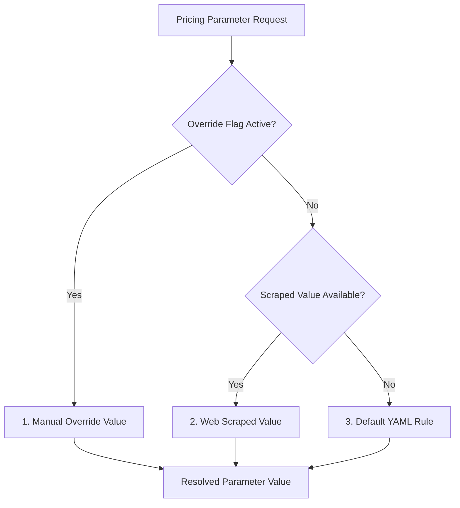

# Dynamic Pricing Engine Specification

This document provides a technical specification for the Dynamic Pricing Model (`backend/ml/pricing_model.py`), including priority rules, machine learning algorithms, and parameters.

---

## 🏛️ Strategy Priority Resolution (Rules Resolver)

The dynamic pricing engine resolves the final parameters for recommendations using a three-tier hierarchy:

1. **Manual Overrides**: Values modified manually by the user in the "Reglas de Tarifas" tab of the profile section (persisted in `config/target_settings.json`).
2. **Web Scraped Values**: Values captured from the competitor's or target's listing web page during public scraping (stored in `listings_daily`).
3. **Default Rules**: Hardcoded values defined in the global configuration file (`config/settings.yaml`).

---

## 📈 Machine Learning Training & Prediction Steps

The ML pricing model forecasts optimal prices over a 30-day window:

1. **Data Collection**: Retrieves historical daily listing records from the database, calculating baseline occupancy trends and pricing curves.
2. **Holiday Markups**: Checks if dates match Argentine national holidays, applying a $+20\%$ pricing premium factor.
3. **k-NN Competitor Bounds**: Restricts price recommendations to remain within the pricing limits of direct competitors in the neighborhood (within $1.5$ km).
4. **Calculations**:
   - Computes daily base recommended prices.
   - Applies weekend markup multiplier ($+15\%$) for Friday and Saturday nights.
   - Adjusts prices based on historical neighborhood occupancy fluctuations.
5. **Output Persistence**: Commits final 30-day recommended trajectory paths to the `price_recommendations` table.
