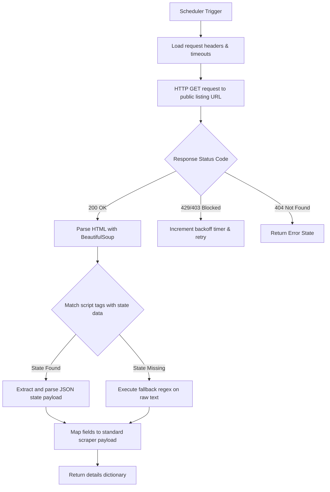

# Public Scraper Specification

This document details the public Web scraper module (`backend/scraper/real_scraper.py`), including anti-blocking strategies, rate limits, HTML/regex parsing, and recovery fallbacks.

---

## 🕷️ Execution Flow

The `RealAirbnbScraper` queries public Airbnb pages using standard HTTP requests:

---

## 🛡️ Anti-Blocking & Rate Limiting Strategy

Because the scraper relies on HTTP requests to public Airbnb listing pages, it is susceptible to rate-limiting blocks. The scheduler implements several defenses:

1. **User Agent Rotation**:
   - Rotates requests among multiple browser headers (Chrome on Windows, Safari on Mac, Chrome on Linux) loaded from `config/settings.yaml` to avoid uniform fingerprint patterns.
2. **Accept-Header Mimicry**:
   - Exposes typical headers expected from standard web browsers (e.g. `Accept-Language: en-US,en;q=0.5`, `Referer: https://www.airbnb.com/`).
3. **Requests Backoff & Retries**:
   - If a request triggers a rate limit (status code `429` or `403`), the scheduler implements exponential backoff.
4. **Proxy/IP Rotation Support**:
   - Can read proxy credentials from environmental parameters to route requests across clean IP pools.

---

## 🔍 Parsing & Regex Extraction Strategy

When loading listing pages, the data resides in serialized javascript states within `<script>` blocks (e.g., matching keywords `state` or `niobe`).
1. The parser searches for the specific JSON blocks and parses them.
2. If the JSON states are obfuscated, the scraper executes resilient fallback regular expressions directly on the HTML body:

- **Cleaning Fee**:
  `r'"cleaningFee"\s*:\s*(\d+(?:\.\d+)?)'` or `r'"cleaning_fee"\s*:\s*(\d+(?:\.\d+)?)'`
- **Stay Limits**:
  `r'"minNights"\s*:\s*(\d+)'` or `r'"minimumNights"\s*:\s*(\d+)'`
- **Weekly Discount**:
  `r'"weeklyDiscountFactor"\s*:\s*(\d+(?:\.\d+)?)'`
- **Weekend Price**:
  `r'"weekendPrice"\s*:\s*(\d+(?:\.\d+)?)'`

This dual-layer extraction (JSON state parsing + Regex matching fallback) ensures excellent reliability.

---

## ⚠️ Limitations & Future Improvements

### Limitations:
- **Dependency on HTML Structure**: If Airbnb changes its internal state keys (e.g., renaming `cleaningFee` to `cleaning_tax` or changing layout structures), the regexes will fail until updated.
- **Data Center Blocks**: Render/Vercel server IPs are often flagged as data center addresses, leading to immediate blocks. The daily robust execution must therefore rest upon GitHub Actions runners.

### Future Improvements:
1. **Dynamic JSON Schema Parser**: Create a parser that dynamically extracts all float values associated with pricing keys in the JSON block, regardless of structure nested depth.
2. **Headless Browser Integration**: Integrate Playwright/Puppeteer with stealth plugins to handle Javascript-heavy challenge pages (e.g. Cloudflare challenges) if raw HTTP blocks increase.
